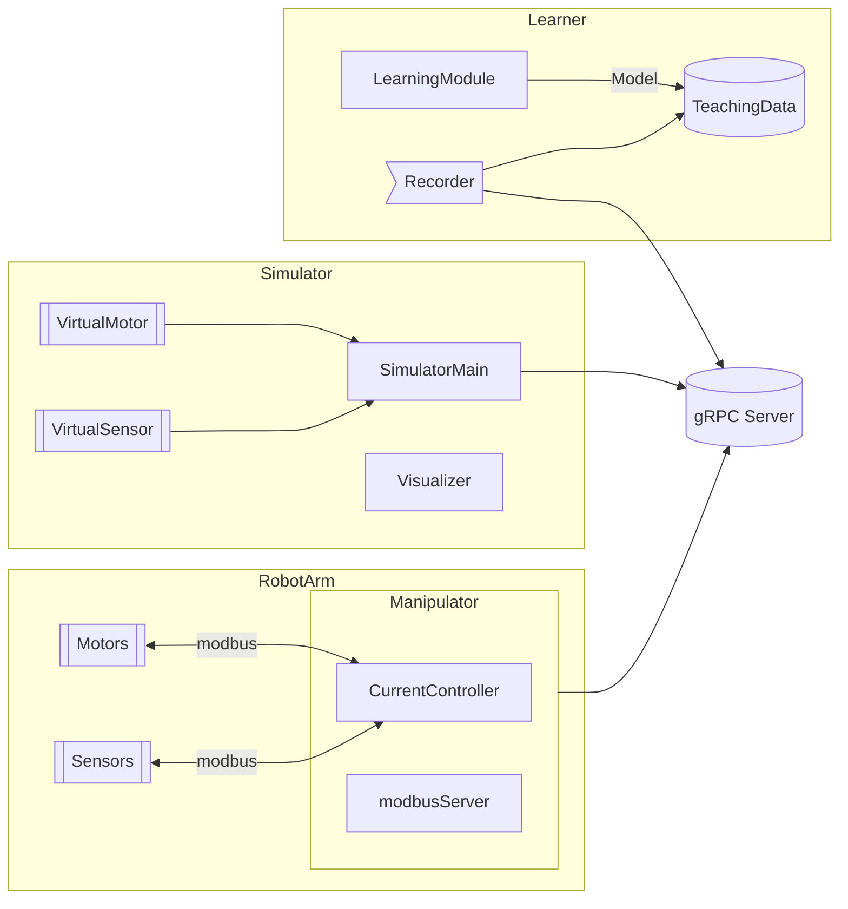

# 全体構成（モジュール）

# タスク

- [ ] シミュレーション
  - [ ] モデル作成
  - [ ] ROSにURDF読み込み
  - [ ] かんたんな制御を試す（PIDとか）
  - [ ] モデルを作成
  - [ ] modbusから受け取った値で制御する
- [] 実機動作
  - [ ] モータ１個の動作確認
  - [ ] modbus環境構築→モータを動かす
  - [ ] 姿勢角度と電流値などのセンサ情報を読み取る
  - [ ] デバイスチェックとかのコードを書く
  - [ ] modbus経由でモータ制御
  - [ ] 電流制御
  - [ ] ハード制作
    - [ ] ハンド設計
    - [ ] ハンド制作
    - [ ] 回路取り替え
    - [ ] モータ制御
  - [ ] アーム全体でmodbusで動かす
  - [ ] 2台のロボットをシンクロ動作させる
- [ ] コントローラ制作
  - [ ] 回路設計
  - [ ] modbusで通信する 
- [ ] 学習手法の確率
  - [ ] 論文読む
  - [ ] 実装

# スケジュール

| 月 | 内容 | 進捗 | 補足 |
| :---: | :--- | :---: | :--- |
| 5/19 | 本格スタート |  |  |
|5 | シミュレーションでPID制御できるようにする |  |  |
|5 | 実機のモーターを動かす |  |  |
|6/15 | modbusの環境整備 |  | シミュレータ、実機ともに。実機を優先して開発する。 |
|6/30 | modbus、複数モータ動作 |  | 実機のみ。modbus頑張る |
|7/15 | シンクロ動作 |  | PIDとかで良いことにする |
| 7末|中間諮問 |  | 

# NA（週次MTG用）

## 5/19
- ロボットのモデルを作成
- ロボットのモデルをROSに読み込んで動かしてみる
- modbusについて学びながら、モータを動かす（Elmo developper studcio)
- 題目決定（6/19）

