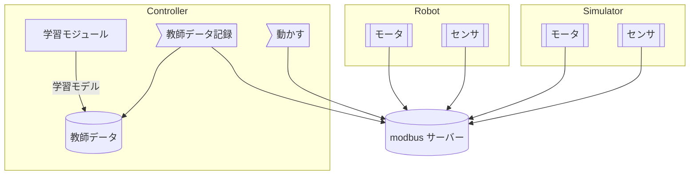

# 全体構成（モジュール）

# タスク

- [ ] シミュレーション
  - [ ] ROSにモデル読み込み
  - [ ] 
- [ ] ハード制作
- [ ] コントローラ制作
  - [ ] 回路設計
  - [ ] modbusで通信する 
- [ ] 学習手法の確率

# スケジュール

| 月 | 内容 | 進捗 | 補足 |
| :---: | :--- | :---: | :--- |
| 5/19 | 本格スタート |  |  |
|5 |  |  |  |

